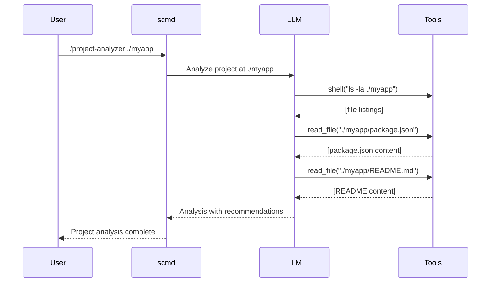

# Tool Calling (Agentic Behavior)

Tool calling enables LLMs to autonomously execute actions instead of just generating text. Commands can use tools to read files, run shell commands, fetch URLs, and more - **automatically**.

!!! info "What is Tool Calling?"
    Tool calling (also called function calling or agentic behavior) allows the LLM to:

    1. **Decide** which tools to use based on the task
    2. **Execute** those tools with appropriate parameters
    3. **See** the results and decide next steps
    4. **Iterate** up to 5 rounds to complete complex tasks

    This enables commands to perform autonomous research, file manipulation, and multi-step workflows.

## How It Works



## Built-in Tools

scmd provides 4 built-in tools that work with any command that has tool calling enabled:

### 1. Shell Tool

Execute safe shell commands (whitelist enforced).

**Parameters:**
- `command` (string, required): Shell command to execute
- `working_dir` (string, optional): Working directory

**Example:**
```json
{
  "name": "shell",
  "parameters": {
    "command": "git status --short"
  }
}
```

**Security:** Only whitelisted commands are allowed:
```
ls, cat, head, tail, find, grep, wc, diff, file, stat, du, df
git, pwd, whoami, date, uname, which, env, echo, printf
curl, wget, ping, dig, nslookup
go, python, python3, node, npm, cargo, make, docker, kubectl
awk, sed, sort, uniq, cut, tr, jq
```

Custom commands can be added to the whitelist.

### 2. Read File Tool

Read file contents with optional line limits.

**Parameters:**
- `path` (string, required): File path to read
- `max_lines` (number, optional): Maximum lines to read

**Example:**
```json
{
  "name": "read_file",
  "parameters": {
    "path": "./config.yaml",
    "max_lines": 50
  }
}
```

### 3. Write File Tool

Write content to files (requires user confirmation).

**Parameters:**
- `path` (string, required): File path to write
- `content` (string, required): Content to write
- `append` (boolean, optional): Append instead of overwrite

**Example:**
```json
{
  "name": "write_file",
  "parameters": {
    "path": "./output.txt",
    "content": "Analysis results...",
    "append": false
  }
}
```

**Security:** Requires user confirmation before writing.

### 4. HTTP GET Tool

Fetch data from URLs.

**Parameters:**
- `url` (string, required): URL to fetch
- `max_size` (number, optional): Max response size in bytes (default: 1MB, max: 10MB)

**Example:**
```json
{
  "name": "http_get",
  "parameters": {
    "url": "https://api.github.com/repos/golang/go",
    "max_size": 10485760
  }
}
```

## Creating Tool-Enabled Commands

To enable tool calling, simply write a command that expects the LLM to use tools. The tool calling system is enabled automatically when the backend supports it.

### Example 1: Project Analyzer

```yaml
name: project-analyzer
version: 1.0.0
description: Analyze project structure and suggest improvements
category: code

args:
  - name: path
    description: Path to project directory
    required: false
    default: "."

prompt:
  system: |
    You are an expert software architect and project analyzer.
    You have access to tools to read files and execute shell commands.

    Use these tools to:
    1. Explore the project structure
    2. Read configuration files
    3. Check for common patterns and anti-patterns
    4. Identify missing files (README, tests, docs)

    Provide actionable recommendations for improving the project.

  template: |
    Analyze the project at: {{.path}}

    Please:
    1. List the directory structure
    2. Read key files (package.json, README.md, go.mod, etc.)
    3. Check for test files
    4. Identify the tech stack
    5. Provide recommendations for:
       - Missing documentation
       - Missing tests
       - Project structure improvements
       - Configuration best practices

model:
  temperature: 0.5
  max_tokens: 2000
```

**Usage:**
```bash
scmd project-analyzer ./my-app
```

**What happens:**
1. LLM reads the prompt
2. Decides to use `shell` tool to list directory: `ls -la ./my-app`
3. Sees the file list, decides to read `package.json`
4. Uses `read_file` tool: `read_file("./my-app/package.json")`
5. Reads `README.md`, `tsconfig.json`, etc.
6. Analyzes all gathered information
7. Provides comprehensive recommendations

### Example 2: Code Refactorer

```yaml
name: auto-refactor
version: 1.0.0
description: Automatically refactor code with improvements
category: code

args:
  - name: file
    description: File to refactor
    required: true

prompt:
  system: |
    You are a code refactoring expert.
    You have access to read_file and write_file tools.

    Process:
    1. Read the specified file
    2. Analyze for improvements (naming, structure, patterns)
    3. Generate refactored version
    4. Write improvements to a new file with .refactored suffix

  template: |
    Refactor the code in {{.file}}

    Focus on:
    - Better variable/function names
    - Improved structure
    - Modern best practices
    - Remove code smells

    Write the refactored code to {{.file}}.refactored

model:
  temperature: 0.3
  max_tokens: 3000
```

**Usage:**
```bash
scmd auto-refactor src/legacy-code.js
```

**Tool calls:**
1. `read_file("src/legacy-code.js")` - Read original
2. **[LLM analyzes and refactors]**
3. `write_file("src/legacy-code.js.refactored", <refactored code>)` - Write improved version

### Example 3: Dependency Checker

```yaml
name: check-deps
version: 1.0.0
description: Check for outdated dependencies and security issues
category: tools

prompt:
  system: |
    You are a dependency management expert.
    Use tools to analyze project dependencies.

  template: |
    Check the dependencies for this project:

    1. Read package.json or go.mod or requirements.txt
    2. For each dependency, fetch latest version from registry
    3. Check for known security vulnerabilities
    4. Provide update recommendations

model:
  temperature: 0.4
  max_tokens: 2000
```

**Tool sequence:**
```
1. shell("find . -name package.json -o -name go.mod")
2. read_file("./package.json")
3. http_get("https://registry.npmjs.org/react/latest")
4. http_get("https://registry.npmjs.org/express/latest")
...
[Analyzes versions and security]
```

## The Agent Loop

scmd implements an agent loop that allows the LLM to iteratively use tools:

```python
for round in range(max_rounds):  # max_rounds = 5
    # 1. Call LLM with available tools
    response = llm.complete_with_tools(prompt, tools)

    # 2. If no tool calls, return final answer
    if not response.tool_calls:
        return response.content

    # 3. Execute all tool calls
    results = []
    for tool_call in response.tool_calls:
        result = execute_tool(tool_call.name, tool_call.parameters)
        results.append(result)

    # 4. Feed results back to LLM
    prompt = build_next_prompt(response, results)

# Return final result
return final_response
```

**Key points:**
- Maximum 5 rounds to prevent infinite loops
- LLM can call multiple tools in each round
- Tool results are fed back for next iteration
- Loop ends when LLM provides final answer

## Backend Support

Not all backends support tool calling. Here's the current status:

| Backend | Tool Calling | Notes |
|---------|--------------|-------|
| **llama.cpp** (qwen3-4b) | ✅ Full support | Default, works offline |
| **Ollama** (some models) | ✅ Full support | Depends on model |
| **OpenAI** | ✅ Full support | GPT-4, GPT-3.5-turbo |
| **Together.ai** | ✅ Full support | Most models |
| **Groq** | ✅ Full support | llama, mixtral models |

Check if your backend supports tool calling:

```bash
scmd backends
```

If tool calling is not supported, commands fall back to regular text generation.

## Security & Safety

### Command Whitelist

The shell tool only allows safe, whitelisted commands:

```go
// internal/tools/shell.go
allowedCommands := map[string]bool{
    "ls": true,
    "git": true,
    "cat": true,
    // ... safe read-only and dev commands
}
```

**Blocked by default:**
- `rm`, `rmdir` (deletion)
- `chmod`, `chown` (permissions)
- `sudo`, `su` (privilege escalation)
- `curl -X POST` (write operations)

### Confirmation Prompts

Destructive tools require user confirmation:

```
[scmd] Tool write_file wants to write to /important/file.txt
[scmd] Content: 1234 bytes
[scmd] Continue? [y/N]:
```

You can bypass confirmations in scripts:

```bash
echo "y" | scmd auto-refactor file.js
```

### Size Limits

- **HTTP GET**: Max 10MB per request
- **File Read**: Truncated at specified max_lines
- **File Write**: No size limit, but requires confirmation
- **Shell Output**: Captured but not limited (use with caution)

### Timeouts

All tool operations have timeouts:

- **Shell commands**: 30 seconds
- **HTTP requests**: 30 seconds
- **File operations**: No timeout

## Advanced Patterns

### Conditional Tool Use

```yaml
prompt:
  template: |
    Analyze the project at {{.path}}

    If go.mod exists, read it and analyze Go dependencies.
    If package.json exists, check npm dependencies.
    If requirements.txt exists, check Python dependencies.

    Use appropriate tools based on what you find.
```

### Multi-Step Workflows

```yaml
name: comprehensive-review
prompt:
  template: |
    Perform a comprehensive code review:

    1. Use shell to find all source files
    2. Read each file (up to 10 files)
    3. Run tests with shell (go test, npm test, etc.)
    4. Read test output
    5. Fetch coding standards from http://company.com/standards
    6. Generate report
    7. Write report to review-YYYY-MM-DD.md
```

### Error Handling

The LLM can handle tool errors gracefully:

```yaml
prompt:
  template: |
    Try to read ./config.yaml
    If that fails, try ./config.yml
    If that fails, try ./.config/config.yaml
    If all fail, use defaults
```

## Debugging Tool Calls

Enable debug mode to see tool execution:

```bash
SCMD_DEBUG=1 scmd project-analyzer ./myapp
```

Output:
```
[DEBUG] LLM requested tool: shell
[DEBUG] Parameters: {"command": "ls -la ./myapp"}
[DEBUG] Tool result: total 48
drwxr-xr-x  12 user  staff   384 Jan  5 10:30 .
drwxr-xr-x  25 user  staff   800 Jan  5 10:25 ..
-rw-r--r--   1 user  staff  1024 Jan  5 10:30 package.json
...

[DEBUG] LLM requested tool: read_file
[DEBUG] Parameters: {"path": "./myapp/package.json"}
[DEBUG] Tool result: {
  "name": "myapp",
  "version": "1.0.0",
  ...
}

[DEBUG] No more tool calls, finalizing response
```

## Best Practices

### 1. Clear Instructions

Tell the LLM exactly what tools to use:

**Good:**
```yaml
prompt:
  template: |
    Use the shell tool to list files in {{.path}}
    Then use read_file to read package.json
    Analyze the dependencies
```

**Bad:**
```yaml
prompt:
  template: |
    Analyze the project  # Too vague
```

### 2. Provide Context

Give the LLM information about available tools:

```yaml
prompt:
  system: |
    You have access to these tools:
    - shell: Execute safe shell commands (ls, git, cat, etc.)
    - read_file: Read file contents
    - write_file: Write files (requires confirmation)
    - http_get: Fetch URLs

    Use them wisely to complete tasks autonomously.
```

### 3. Set Appropriate Limits

```yaml
model:
  max_tokens: 3000     # Enough for multiple tool calls
  temperature: 0.5     # Not too creative for tool use
```

### 4. Handle Errors

```yaml
prompt:
  template: |
    Try to complete the task.
    If tools fail, explain what went wrong.
    Provide alternative approaches when possible.
```

### 5. Limit Scope

Don't let the LLM go wild:

**Good:**
```yaml
prompt:
  template: |
    Read package.json and analyze dependencies.
    Limit to top 10 most important packages.
```

**Bad:**
```yaml
prompt:
  template: |
    Read all files in the project and analyze everything.
    # This could trigger hundreds of file reads!
```

## Examples

See [Tool Calling Examples](../examples/tool-calling-examples.md) for complete, runnable examples:

- Project structure analyzer
- Automated code refactorer
- Dependency security checker
- Documentation generator
- Test coverage analyzer

## Troubleshooting

### "Tool calling not supported"

Your backend doesn't support tool calling. Options:

1. Use llama.cpp with qwen3-4b (default)
2. Use Ollama with a tool-calling model
3. Use OpenAI (GPT-4 or GPT-3.5-turbo)
4. Command falls back to text-only mode

### "Command not in whitelist"

The shell command you're trying to use is blocked for security. Options:

1. Use a different, allowed command
2. Modify the command spec to use read_file instead
3. Add the command to whitelist (advanced)

### Tool Loop Exceeded

LLM hit the 5-round limit. This usually means:

1. Task is too complex (break into smaller commands)
2. LLM is confused (improve prompt clarity)
3. Tool results aren't helpful (check tool output)

**Fix:** Simplify the task or improve the prompt.

### Tool Results Too Large

HTTP or file reads returning huge responses:

```yaml
# Limit HTTP response size
http_get(url, max_size=1048576)  # 1MB

# Limit file lines
read_file(path, max_lines=100)
```

## Next Steps

- [Hooks Documentation](hooks.md) - Add pre/post automation
- [Composition Documentation](composition.md) - Chain tool-enabled commands
- [Tool API Reference](../reference/tool-api.md) - Complete tool specifications
- [Adding Tools](../contributing/adding-tools.md) - Create custom tools
